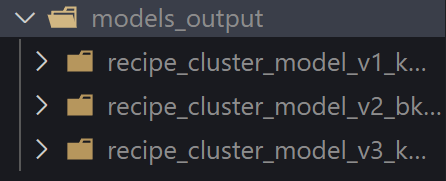
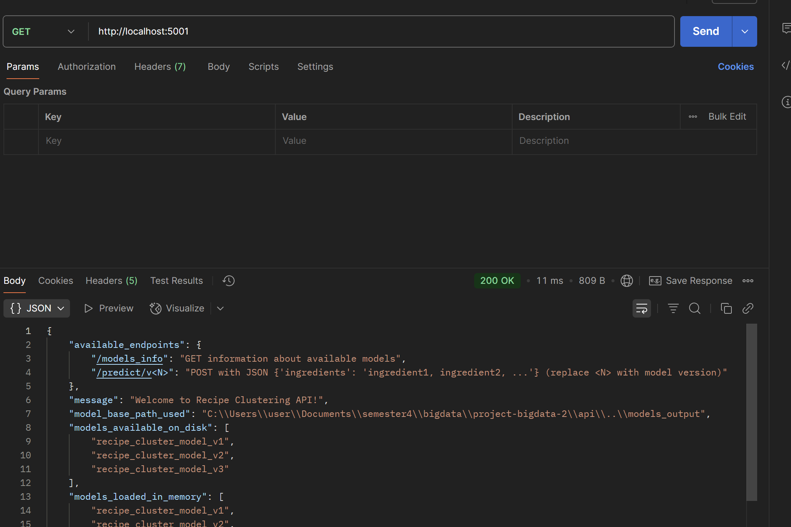

# project-bigdata-2

## Anggota Kelompok

| Nama                  | NRP        |
| --------------------- | ---------- |
| Maulana Ahmad Zahiri  | 5027231010 |
| Danendra Fidel Khansa | 5027231063 |
| Dimas Andhika DIputra | 5027231074 |

## Langkah-Langkah Menjalankan Proyek

### Setup Apache Kafka dan Zookeeper

Instalasi dapat dilakukan dengan menggunakan file `docker-compose.yml` dengan konfigurasi berikut:

```yml
services:
  zookeeper:
    image: "bitnami/zookeeper:3.8" # Versi spesifik untuk zookeeper juga baik
    container_name: zookeeper
    environment:
      - ALLOW_ANONYMOUS_LOGIN=yes
    ports:
      - "2181:2181"

  kafka:
    image: "bitnami/kafka:3.3.2" # Coba versi ini dulu
    container_name: kafka
    ports:
      - "9092:9092"
    environment:
      # Konfigurasi untuk mode Zookeeper
      - KAFKA_BROKER_ID=1
      - KAFKA_ZOOKEEPER_CONNECT=zookeeper:2181 # Penting untuk mode Zookeeper
      - KAFKA_ADVERTISED_LISTENERS=PLAINTEXT://localhost:9092
      - KAFKA_LISTENERS=PLAINTEXT://:9092 # Untuk internal container
      - ALLOW_PLAINTEXT_LISTENER=yes # Biasanya untuk kompatibilitas
    depends_on:
      - zookeeper
```

### 1. Setup Virtual Environment Python

Diasumsikan Anda sudah mengatur `pyenv local 3.8.18` di root direktori proyek.

```bash
# (Dari root direktori proyek)
Hapus venv lama jika ada (opsional, untuk fresh start)
rm -rf venv

# Buat virtual environment baru dengan Python 3.8
python -m venv venv

# Aktifkan virtual environment
source venv/bin/activate  # untuk Linux/Mac
source venv/Scripts/activate # untuk Windows

# Instal dependensi
pip install --upgrade pip
pip install kafka-python pandas pyspark
```

### 2. Jalankan Kafka & Zookeeper via Docker Compose

(Dari root direktori proyek, di terminal terpisah)

```bash
docker-compose up -d
```

### 3. Buat Kafka Topic

(Dari root direktori proyek, di terminal yang sama dengan docker-compose atau terminal baru)

```bash
# Masuk ke image dan bikin topic
docker-compose exec kafka kafka-topics.sh --create \
  --topic recipe_topic \
  --bootstrap-server localhost:9092 \
  --partitions 1 \
  --replication-factor 1

# Cek apakah topic tersedia
kafka-topics.sh --list --bootstrap-server localhost:9092
```

Dokumentasi:

.png>)

.png>)

### 4. Jalankan Kafka Consumer

Consumer akan mendengarkan pesan dan menyimpan batch data.
(Buka Terminal BARU, dari root direktori proyek)

```bash
source venv/bin/activate  # untuk Linux/Mac
source venv/Scripts/activate # untuk Windows
python kafka/consumer.py
```

### 5. Jalankan Kafka Producer

Producer akan membaca dataset dan mengirimkannya ke Kafka.
(Buka Terminal BARU LAINNYA, dari root direktori proyek)

```bash
source venv/bin/activate  # untuk Linux/Mac
source venv/Scripts/activate # untuk Windows
python kafka/producer.py
```

Dokumentasi:

.png>)

.png>)

### 6. Jalankan Script Spark untuk Melatih Model

Script ini akan membaca data batch yang disimpan oleh consumer, melakukan preprocessing, dan melatih model K-Means.

Model yang digunakan:

- Model v1 (Data: ~1/3): KMeans dengan TF-IDF.

  - **Pengujian Konsep Dasar**: Dengan menggunakan sebagian kecil data (sekitar 1/3), tim dapat dengan cepat memvalidasi apakah pendekatan klasterisasi menggunakan K-Means dan TF-IDF memberikan hasil yang masuk akal. Ini membantu memastikan bahwa representasi teks TF-IDF mampu menangkap informasi yang cukup untuk klasterisasi dan bahwa K-Means adalah algoritma yang cocok untuk tugas ini.
  - **Efisiensi Komputasi**: Melatih model pada subset data yang lebih kecil secara signifikan mengurangi waktu komputasi yang dibutuhkan. Ini sangat berguna pada tahap awal pengembangan, di mana banyak eksperimen dan penyesuaian mungkin diperlukan.
  - **Identifikasi Masalah Awal**: Jika ada masalah mendasar dengan data atau pendekatan yang dipilih (misalnya, klaster yang tidak berarti, konvergensi yang buruk), masalah tersebut dapat terdeteksi lebih awal dengan dataset yang lebih kecil, tanpa harus menunggu proses pelatihan pada data penuh yang lebih lama.

- Model v2 (Data: ~2/3): BisectingKMeans dengan TF-IDF.

  - **Peningkatan Generalisasi**: Dengan melatih model pada sebagian besar data (sekitar 2/3), model memiliki kesempatan untuk mempelajari pola-pola yang lebih kaya dan lebih representatif dari keseluruhan dataset. Ini membantu model untuk menggeneralisasi lebih baik ke data yang tidak terlihat dan menghasilkan klaster yang lebih koheren dan bermakna.
  - **Mengurangi Bias**: Menggunakan lebih banyak data dapat membantu mengurangi potensi bias yang mungkin ada jika model hanya dilatih pada subset yang sangat kecil yang mungkin tidak sepenuhnya merepresentasikan distribusi data.
  - **Konfirmasi Skalabilitas Awal**: Ini juga memberikan indikasi awal tentang bagaimana performa model akan meningkat seiring dengan penambahan data, sebelum melangkah ke data penuh.

- Model v3 (Data: Semua): KMeans dengan Word2Vec (jadi variasi pada featurisasi dan data penuh).
  - **Pemanfaatan Data Penuh**: Menggunakan seluruh data memastikan bahwa model memiliki akses ke semua informasi yang tersedia, memungkinkan pengambilan keputusan yang paling akurat dan pembentukan klaster yang paling optimal berdasarkan semua pola yang ada.
  - **Optimasi Kinerja Akhir**: Ini adalah langkah untuk menghasilkan model produksi yang paling kuat, yang dapat menangani kompleksitas data riil dan memberikan hasil klasterisasi yang paling akurat.
  - **Eksplorasi Variasi Featurisasi**: Aspek "variasi pada featurisasi" sangat penting. Meskipun TF-IDF adalah baseline yang baik, mungkin ada metode representasi teks lain (misalnya, Word Embeddings seperti Word2Vec, GloVe, atau FastText, atau bahkan Transformer-based embeddings seperti BERT/RoBERTa jika cocok dengan konteks) yang dapat menangkap semantik dan hubungan kontekstual antar kata dengan lebih baik. Dengan mengeksplorasi variasi ini, tim dapat menemukan representasi yang menghasilkan klaster yang lebih bermakna dan terpisah dengan jelas, sehingga meningkatkan kualitas klasterisasi secara signifikan.

(Dari root direktori proyek, di terminal baru atau yang sudah ada)

```bash
source venv/bin/activate  # untuk Linux/Mac
source venv/Scripts/activate # untuk Windows

# Install Pyspark yang kompatibel
pip install pyspark==3.5.1

# Pastikan direktori output model ada
mkdir -p models_output

# Jalankan script training model
python model/train_model.py
```

Dari folder models_output yang telah dibuat, akan muncul folder train `recipe_cluster_model_x`

Dokumentasi:

.png>)



### 7. Jalankan Script API untuk Mengetes Cluster dari Dataset ini

```bash
# Jalankan script api
python api/app.py
```

### 8. Buka POSTMAN untuk API TESTnya

Berikut untuk macam endpointnya:

```endpoint
# Cek Status API
http://localhost:5001

# Cek Informasi Model
http://127.0.0.1:5001/models_info

# Model 1
http://localhost:5001/predict/v1_kmeans_tfidf_k10

# Model 2
http://localhost:5001/predict/v2_bkm_tfidf_k10

# Model 3
http://localhost:5001/predict/v3_kmeans_word2vec_k10
```

Berikut Dokumentasinya:

- Cek Informasi API (GET)

```endpoint
http://localhost:5001
```



- Cek Informasi Model (GET)

```endpoint
http://localhost:5001
```

.png>)

- Input yang Salah (POST)

```json
{
  "bahan": "any, ingredients"
}
```

.png>)

- Cluster 0

```json
{
  "ingredients": "romaine lettuce, cherry tomatoes, cucumber, red onion, feta cheese, Kalamata olives, extra virgin olive oil, red wine vinegar, Dijon mustard, dried oregano"
}
```

.png>)

- Cluster 1

```json
{
  "ingredients": "all-purpose flour, unsweetened cocoa powder, baking soda, baking powder, salt, granulated sugar, eggs, milk, vegetable oil, vanilla extract, boiling water"
}
```

.png>)

- Cluster 2

```json
{
  "ingredients": "spaghetti, ground beef, canned crushed tomatoes, onion, garlic, olive oil, basil, oregano, parmesan cheese"
}
```

.png>)

- Cluster 3

```json
{
  "ingredients": "chicken pieces, all-purpose flour, paprika, garlic powder, onion powder, salt, black pepper, buttermilk, vegetable oil for frying"
}
```

.png>)
